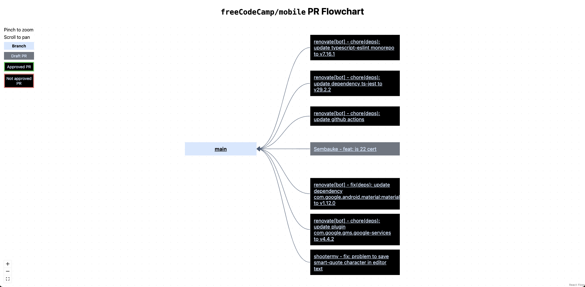

# PR Visualizer

PR visualizer illuminates the relations between different PRs in the same repo and helps with keeping track of chain PRs. Note that only ServiceTitan repos are supported in this tool.

  

## Running the project

1. Make sure [Node.js](https://nodejs.org/en) 20 (or above) is installed.
1. Install project dependencies: `npm i`.
1. Provide your GitHub personal access token (PAT) in the `GITHUB_PAT` environment variable.
1. Optionally set `ALLOWED_ORGS` and `ALLOWED_REPOS` environment variables with comma separated GitHub organizations and repositories. This is useful when using PR Visualizer for a specific org/repo.
1. Run `npm run dev` to start the project in the development mode.
1. Alternatively run `npm run build` to build the project and `node .next/standalone/server.js` to start the production build.
